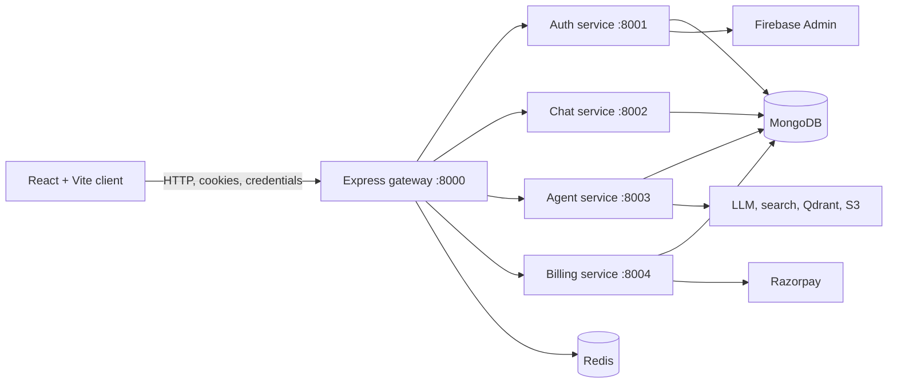

# KyzenAI

KyzenAI is a full-stack AI workspace that combines conversational assistance, coding help, web search, document generation, multimodal analysis, persistent chat history, and credit-based billing in one application.

The project is organized as a React/Vite client and a Node.js microservice backend. An Express gateway is the single browser-facing backend entry point. It validates session cookies, forwards requests to the appropriate service, and keeps the frontend decoupled from the internal service topology.

## Contents

- [Capabilities](#capabilities)
- [Architecture](#architecture)
- [Repository Layout](#repository-layout)
- [Request Flow](#request-flow)
- [Technology](#technology)
- [Prerequisites](#prerequisites)
- [Local Development](#local-development)
- [Environment Configuration](#environment-configuration)
- [HTTP API](#http-api)
- [Credits and Plans](#credits-and-plans)
- [Docker and Deployment](#docker-and-deployment)
- [Frontend Deployment](#frontend-deployment)
- [Security and Production Notes](#security-and-production-notes)
- [Validation and Testing](#validation-and-testing)
- [Troubleshooting](#troubleshooting)
- [License](#license)

## Capabilities

### User experience

- Google sign-in through Firebase Authentication.
- Persistent conversations and message history.
- Conversation creation, selection, and renaming.
- Responsive chat interface with loading states.
- Markdown and GitHub-flavored Markdown rendering.
- Syntax-highlighted assistant code blocks.
- Browser speech recognition support.
- File uploads for PDF and image workflows.
- Generated coding artifacts with an editor and preview.
- Billing drawer with Starter and Pro subscription plans.
- Razorpay checkout integration.

### AI workflows

KyzenAI routes requests to specialized agents through LangGraph:

- General conversation.
- Coding assistance and artifact generation.
- Web search through Tavily.
- PDF generation.
- PowerPoint generation.
- PDF question answering with retrieval-augmented generation.
- Image generation.
- Uploaded-image analysis with Gemini.

Generated PDFs, presentations, and images can be uploaded to Amazon S3 and returned through signed download URLs. PDF retrieval uses Qdrant for vector search.

### Usage controls

- New users receive a free plan with 100 credits.
- Credit costs are applied by agent type.
- Redis-backed per-minute limits protect the agent service.
- Paid plans are purchased through Razorpay and updated through the billing and auth services.

## Architecture



### Services

| Service | Port | Responsibility |
| --- | ---: | --- |
| Client | `5173` | React interface, authentication UI, chat, artifacts, billing UI |
| Gateway | `8000` | CORS, session protection, routing, authenticated user forwarding |
| Auth | `8001` | Firebase token verification, users, sessions, logout, credits |
| Chat | `8002` | Conversations and messages |
| Agent | `8003` | LangGraph orchestration and AI generation workflows |
| Billing | `8004` | Razorpay order creation and payment verification |
| Redis | `6379` | Sessions, session lookup, request limits, cached message data |

The gateway is the intended public backend endpoint. Browser requests should normally go to the gateway rather than directly to an internal service.

## Repository Layout

```text
.
├── client/                         React/Vite frontend
│   ├── src/components/             Chat, navigation, billing, artifact UI
│   ├── src/features/               API feature functions
│   ├── src/pages/                  Application pages
│   ├── src/redux/                  Redux slices and store
│   ├── utils/                      Axios and Firebase configuration
│   └── vercel.json                 Vercel API rewrite
├── server/
│   ├── gateway/                    Public Express gateway
│   ├── services/
│   │   ├── auth/                   Firebase and user service
│   │   ├── chat/                   Conversation and message service
│   │   ├── agent/                  AI orchestration service
│   │   └── billing/                Razorpay service
│   ├── shared/redis/               Shared ioredis client
│   └── docker-compose.yml           Redis plus gateway Compose definition
├── backendDeplyoment.tldr          Backend deployment design notes
├── frontendDeployment.tldr         Frontend deployment design notes
└── package.json                    Root dependency metadata
```

## Request Flow

### Authentication

1. The user signs in with Google through Firebase on the client.
2. The client sends the Firebase ID token to `POST /api/auth/login`.
3. The auth service verifies the token with Firebase Admin.
4. A MongoDB user is created or loaded.
5. The auth service stores a seven-day session in Redis.
6. An HTTP-only `session` cookie is returned to the browser.
7. Protected gateway routes read the cookie and load `session-<sessionId>` from Redis.
8. The gateway forwards the authenticated user ID to downstream services in the `x-user-id` header.

### AI request

1. The client submits a message to `POST /api/agent/chat`.
2. The gateway validates the session.
3. The agent service accepts optional multipart file data through Multer.
4. The request is routed by the LangGraph graph to the selected agent.
5. The agent may call an LLM, search provider, vector database, image provider, or file-generation utility.
6. Credits are deducted through the auth service.
7. The assistant response and generated artifact metadata are returned to the client.

## Technology

### Frontend

- React 19
- Vite 8
- Redux Toolkit and React Redux
- Axios
- Firebase client SDK
- Tailwind CSS 4
- Motion
- Lucide React and React Icons
- Monaco Editor
- React Markdown, remark-gfm, and syntax highlighting

### Backend

- Node.js with ECMAScript modules
- Express 5
- MongoDB through Mongoose
- Redis through ioredis
- Firebase Admin SDK
- LangChain and LangGraph
- Groq, Google Gemini, and OpenRouter integrations
- Tavily search
- Qdrant vector database
- AWS S3
- PDFKit, pdf-parse, and PptxGenJS
- Razorpay

## Prerequisites

Install or provision the following before starting the application:

- Node.js compatible with the installed dependencies.
- npm.
- Redis available at `localhost:6379` for local development.
- MongoDB, either local or hosted.
- A Firebase project with Google sign-in enabled.
- A Firebase Admin service account for the auth service.
- Provider credentials for the AI workflows you intend to use.
- An S3 bucket and AWS credentials for generated files.
- Qdrant credentials for PDF retrieval.
- Razorpay credentials for billing.

## Local Development

There is no root script that starts the complete system. Install and run each package separately.

### 1. Install dependencies

```powershell
cd C:\Kyzen\client
npm install

cd C:\Kyzen\server\gateway
npm install

cd C:\Kyzen\server\services\auth
npm install

cd C:\Kyzen\server\services\chat
npm install

cd C:\Kyzen\server\services\agent
npm install

cd C:\Kyzen\server\services\billing
npm install
```

### 2. Start Redis

Run Redis locally on port `6379`. With Docker:

```powershell
docker run --name kyzen-redis -p 6379:6379 -d redis
```

If the container already exists, start it with:

```powershell
docker start kyzen-redis
```

### 3. Configure environment files

Create the files described in [Environment Configuration](#environment-configuration). Keep secrets out of Git.

### 4. Start backend services

Open one terminal for each service:

```powershell
cd C:\Kyzen\server\services\auth
npm run dev
```

```powershell
cd C:\Kyzen\server\services\chat
npm run dev
```

```powershell
cd C:\Kyzen\server\services\agent
npm run dev
```

```powershell
cd C:\Kyzen\server\services\billing
npm run dev
```

Start the gateway in another terminal:

```powershell
cd C:\Kyzen\server\gateway
npm run dev
```

### 5. Start the frontend

```powershell
cd C:\Kyzen\client
npm run dev
```

Open the Vite URL shown in the terminal, normally `http://localhost:5173`.

### Production-style local start

Replace `npm run dev` with `npm start` for each backend package. The client can be built and previewed with:

```powershell
cd C:\Kyzen\client
npm run build
npm run preview
```

## Environment Configuration

The repository currently does not provide sanitized `.env.example` files. Create local environment files and substitute your own values.

### Client environment

Create `client/.env`:

```env
VITE_SERVER_URL=http://localhost:8000
VITE_FIREBASE_API_KEY=your_firebase_web_api_key
VITE_RAZORPAY_KEY_ID=your_razorpay_public_key
```

Firebase client configuration is also defined in `client/utils/firebase.js`; review that file before moving the project between Firebase projects.

### Gateway environment

Create `server/gateway/.env`:

```env
PORT=8000
FRONTEND_URL=http://localhost:5173
REDIS_URL=redis://localhost:6379
AUTH_SERVICE=http://localhost:8001
CHAT_SERVICE=http://localhost:8002
AGENT_SERVICE=http://localhost:8003
BILLING_SERVICE=http://localhost:8004
```

When the gateway runs inside the Compose network, use `redis://redis:6379` for `REDIS_URL` because `redis` is the Compose service name.

### Auth service environment

Create `server/services/auth/.env`:

```env
PORT=8001
MONGODB_URI=mongodb://localhost:27017/kyzen-auth
REDIS_URL=redis://localhost:6379
```

The auth service also requires Firebase Admin credentials. The current implementation loads them from `server/services/auth/serviceAccountKey.json`. Do not commit this file or bake it into a production image; use a secret mount or provider-managed secret instead.

### Chat service environment

Create `server/services/chat/.env`:

```env
PORT=8002
MONGODB_URI=mongodb://localhost:27017/kyzen-chat
```

The chat service uses the shared Redis client and should also receive:

```env
REDIS_URL=redis://localhost:6379
```

### Agent service environment

Create `server/services/agent/.env`:

```env
PORT=8003
MONGODB_URI=mongodb://localhost:27017/kyzen-agent
REDIS_URL=redis://localhost:6379
CHAT_SERVICE=http://localhost:8002
AUTH_SERVICE=http://localhost:8001

GROQ_API_KEY=your_groq_key
GEMINI_API_KEY=your_gemini_key
OPENROUTER_API_KEY=your_openrouter_key
TAVILY_API_KEY=your_tavily_key

AWS_REGION=your_aws_region
AWS_ACCESS_KEY_ID=your_aws_access_key
AWS_SECRET_KEY=your_aws_secret_key
AWS_BUCKET_NAME=your_s3_bucket

QDRANT_ENDPOINT=your_qdrant_endpoint
QDRANT_API_KEY=your_qdrant_key
```

Some provider integrations use library-specific configuration conventions. Confirm the names in the service `config` files when enabling a provider.

### Billing service environment

Create `server/services/billing/.env`:

```env
PORT=8004
MONGODB_URI=mongodb://localhost:27017/kyzen-billing
REDIS_URL=redis://localhost:6379
AUTH_SERVICE=http://localhost:8001
RAZORPAY_KEY_ID=your_razorpay_key_id
RAZORPAY_KEY_SECRET=your_razorpay_key_secret
```

Use the internal service hostname instead of `localhost` when services run in the same container network.

## HTTP API

All browser-facing paths below are served through the gateway at `http://localhost:8000`.

### Health

| Method | Path | Auth | Description |
| --- | --- | --- | --- |
| `GET` | `/health` | No | Returns `OK` when the gateway process is running |

### Authentication

| Method | Path | Description |
| --- | --- | --- |
| `POST` | `/api/auth/login` | Verify Firebase token and create a session cookie |
| `GET` | `/api/auth/logout` | Remove the current session from Redis |
| `POST` | `/api/auth/update-plan` | Apply a plan and credits to a user |
| `POST` | `/api/auth/deduct-credits` | Deduct credits for an agent request |

### User and conversations

| Method | Path | Description |
| --- | --- | --- |
| `GET` | `/api/me` | Return the authenticated user represented by the session |
| `GET` | `/api/chat/create-conversation` | Create a conversation |
| `GET` | `/api/chat/get-conversations` | List conversations for a user |
| `POST` | `/api/chat/update-conversation` | Rename a conversation |
| `POST` | `/api/chat/save-message` | Save a message |
| `GET` | `/api/chat/get-messages/:conversationId` | Load conversation messages |

### AI and billing

| Method | Path | Description |
| --- | --- | --- |
| `POST` | `/api/agent/chat` | Run an AI agent; accepts optional multipart field `file` |
| `POST` | `/api/billing/create` | Create a Razorpay order |
| `POST` | `/api/billing/verify` | Verify a payment and apply the selected plan |

Protected routes require the HTTP-only `session` cookie created during login. The client sends requests with credentials enabled.

## Credits and Plans

The plan definitions currently live in `server/services/billing/config/Plans.js`.

| Plan | Price | Credits | Validity |
| --- | ---: | ---: | ---: |
| Free | ₹0 | 100 | 30 days |
| Starter | ₹199 | 500 | 30 days |
| Pro | ₹499 | 1,000 | 30 days |

Current agent credit costs are defined in the auth controller:

| Agent | Cost |
| --- | ---: |
| Chat | 1 |
| Search | 5 |
| Coding | 10 |
| PDF | 10 |
| PPT | 10 |
| Vision | 10 |

Redis-backed per-minute limits are also configured for the agent service. Current limits include 20 requests/minute for chat and 5 requests/minute for coding, PDF, PPT, image, and search workflows.

## Docker and Deployment

Each backend component has its own Dockerfile. Build from the `server` directory so shared code can be copied into the images:

```powershell
cd C:\Kyzen\server

docker build -f gateway/Dockerfile -t kyzen-gateway .
docker build -f services/auth/Dockerfile -t kyzen-auth .
docker build -f services/chat/Dockerfile -t kyzen-chat .
docker build -f services/agent/Dockerfile -t kyzen-agent .
docker build -f services/billing/Dockerfile -t kyzen-billing .
```

The current `server/docker-compose.yml` starts Redis and the gateway only. It does not start MongoDB, auth, chat, agent, or billing, so it is not a complete application stack. Those services must be deployed separately or added to a fuller Compose configuration.

The Compose gateway uses the Docker DNS name `redis`:

```env
REDIS_URL=redis://redis:6379
```

A gateway started directly on the host must use `redis://localhost:6379` instead.

The deployment notes in `backendDeplyoment.tldr` describe an AWS ECR and ECS-oriented deployment flow. They are design notes rather than executable infrastructure code. A production deployment should provide, for each service:

- A private container image in ECR.
- Service-specific environment variables from AWS Secrets Manager or SSM Parameter Store.
- Network access to Redis and MongoDB.
- Health checks and logs.
- Least-privilege IAM roles.
- TLS at the public load balancer.
- Autoscaling and resource limits appropriate to model workloads.

## Frontend Deployment

Build the client with:

```powershell
cd C:\Kyzen\client
npm run build
```

The client includes `client/vercel.json`, which rewrites `/api/:path*` to a fixed AWS load balancer hostname. Update that hostname for your environment before deploying, and ensure the client Axios base URL and rewrite strategy agree. The rewrite only applies to relative browser requests; an absolute `VITE_SERVER_URL` takes precedence in the client.

For Vercel:

1. Set the project root to `client`.
2. Configure the client `VITE_*` variables in the Vercel project settings.
3. Replace the environment-specific load balancer URL in `client/vercel.json` if needed.
4. Deploy with the Vite build command.
5. Add the deployed frontend origin to the gateway `FRONTEND_URL` value.

## Security and Production Notes

Before publishing or deploying this project, address the following:

- Rotate any credentials that have ever been committed, pasted into logs, or included in local files.
- Never commit Firebase Admin keys, AWS keys, MongoDB connection strings, Redis URLs with passwords, model-provider keys, or Razorpay secrets.
- Use secret injection rather than copying `serviceAccountKey.json` into a Docker image.
- Protect internal auth operations such as plan updates and credit deductions from public callers.
- Verify conversation ownership before reading, updating, or saving messages.
- Set session cookies to `secure: true` behind HTTPS and configure an appropriate production `sameSite` policy.
- Add cookie parsing and logout integration tests for the auth service.
- Validate that Razorpay payments belong to the authenticated user and cannot be replayed.
- Restrict CORS to known frontend origins.
- Add request size limits, rate limiting, structured logging, downstream health checks, and observability.
- Treat generated artifact previews and uploaded files as untrusted content.
- Use writable, monitored temporary storage for uploaded files and clean up failed jobs.
- Avoid logging session IDs, signed URLs, tokens, or provider credentials.

This README describes the current implementation. It is not a claim that the listed production controls are already complete.

## Validation and Testing

The client provides:

```powershell
cd C:\Kyzen\client
npm run lint
npm run build
```

The backend packages currently provide development and start scripts, but no automated test suite. The server root `test` script is a placeholder. A practical smoke test after startup is:

```powershell
Invoke-WebRequest http://localhost:8000/health
```

Expected response:

```text
OK
```

For a meaningful end-to-end check, validate Google login, session persistence, conversation creation, an agent request, file upload, logout, and a Razorpay test payment separately.

## Troubleshooting

### `getaddrinfo ENOTFOUND redis`

The hostname `redis` is available only inside the Docker Compose network. For a gateway or service running directly on Windows, set:

```env
REDIS_URL=redis://localhost:6379
```

For a container running in Compose, use:

```env
REDIS_URL=redis://redis:6379
```

### Gateway starts but requests fail

Check that auth, chat, agent, and billing are running on ports `8001` through `8004`, and that the gateway service URL variables point to reachable addresses.

### Browser reports a CORS or cookie error

Confirm that `FRONTEND_URL` exactly matches the browser origin, that the client sends credentials, and that the gateway is reachable from the browser.

### Agent requests fail

Check Redis, MongoDB, the chat and auth service URLs, uploaded-file permissions, and the provider credentials required by the selected agent.

### Generated files cannot be downloaded

Check AWS region, bucket name, IAM permissions, and S3 credentials. Signed URLs are temporary and should not be expected to remain valid indefinitely.

## License

No explicit open-source license is currently defined in the repository. Add a license file before distributing KyzenAI publicly.
